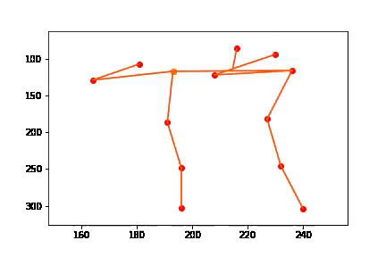
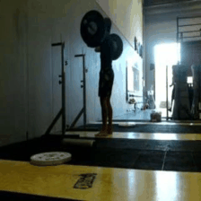

# Hierarchical Video Prediction

Jeffrey Zhang, Zhongxia Yan

We implemented a generative model to predict future frames of a human action video hierarchically. This repo contains all of the infrastructure and logic for our project. Our models extends off the model described in [Learning to Generate Long-term Future via Hierarchical Prediction](https://sites.google.com/a/umich.edu/rubenevillegas/hierch_vid). We independently explored many ways to improve the model and document the explorations here.

## Summary
Video prediction involves predicting `T` future frames of a video given `k` original frames of the video. Our hierarchical approach predicts **human action** videos by taking the pose (location of human joints) in the `k` original frames (we can estimate the pose using methods such as the [Hourglass Network](https://arxiv.org/abs/1603.06937)), predicting the pose in the next `T` frames, then predicting `T` frames that correspond to the `T` poses and also match the `k` original frames.


## Dataset
We train and evaluate our models on the [Penn Action Dataset](http://dreamdragon.github.io/PennAction/). Below are examples of an image and a gaussianized pose.

 

## Method
### LSTM


There are 13 `(x, y)` coordinates per pose. For the first `k` frames, we feed the 13 `(x, y)` coordinate values of the joints into the LSTM and iteratively generate the hidden states. For the next `T` frames, we feed in `0` and record the hidden state outputs from `t = k + 1` to `k + T`. We use two fully connected layers on top of each hidden state vector to predict 13 `(x, y)` coordinates for the pose.


### Analogy Network


Our analogy network is a generative model that takes in the video frame at time `t1`, pose at time `t1`, and the pose at time `t2` to predict the video frame at time `t2`. In our model, `f_img` and `f_pose` are both encoders implemented as the first `c` convolution layers of VGG (`c` is a parameter that we explore), and `f_dec` is the decoder implemented with deconvolutions mirroring the VGG convolutions of the encoders. Here our pose are gaussian heatmaps with the joint `(x, y)` coordinates as centers (`g` represents the gaussian operator).


Our loss function has three parts.


## Results

### LSTM
We show the ground truth (red) and predicted (orange) location of joints within a cropped frame.


#### Discussion
Our results show that our implementation of the LSTM network is able to capture the movement of squats accurately. There is high variation in the form and speed of how people do squats. The LSTM model is able to capture an "average" prediction model based on the trained videos. Thus, though the predicted joint locations show a convincing alternative to the ground truth. We show results of pose prediction on squat videos. The squat motions are very similar, albeit at different paces.

Our initial test with a simple sequence-to-sequence network with 128 hidden units and no fully connect output layer did not work well in predicting poses for test videos. The simple sequence-to-sequence network was able to overfit to training data, but was unable to make meaningful predictions for test images. By increasing the number of hidden units in the LSTM block and adding two fully connected layers to the output of the LSTM, we were able to create a working prediction model.

### Analogy Network
We present the results of our analogy network. For each action, the top gif is the ground truth, while the bottom gif is the output of our analogy network. Note: if the top and bottom gifs are out of sync, refresh the page.

|   Baseball Pitch   |  Baseball Swing  | Bench Press | Bowl |
| ------------- |:-------------:|:-----:|:-----:|
|     |    |   |    |

|   Clean and Jerk  |  Golf Swing  | Jump Rope | Jumping Jacks |
| ------------- |:-------------:|:-----:|:-----:|
|     |    |   |    |

|   Pullup  |  Pushup  | Squat | Tennis Serve |
| ------------- |:-------------:|:-----:|:-----:|
|     |    |   |    |

#### Discussion
We can see that the outputs of the analogy network captures the semantics of the human figure well. The generation is able to generate a human figure that fits the locations of the joints at time `t2`, with an almost perfectly unaltered background. Both the figure and background are not blurry. However, we found that the discriminator is not able to train the generator to perfectly reconstruct facial and other fine details. In addition, the discriminator not able to constrain the the generated figure in time `t2` to look the same as the true human figures in time `t1`, i.e. often human figures in time `t2` wears different colored clothes. Additionally, instruments and tools used by humans (e.g., barbells, bats, rackets, etc.) had difficulty transferring over into the generated frames. Finally, although the generator is able to erase most of the figure from its location at time `t1`, there is sometimes a shadow of leftover human figure, and interpolation of background at the location of the human at time `t1` sees limited success. In summary, the analogy network captures the semantics of the human figure well, but sometimes fails at generating fine details and non-human areas / objects realistically.

## Experimentation

The results above are our best and we've experiment with various network architectures and parameters along the way. Below are a small subset of our experimentations.

### Weak Discriminator
Initially we trained our discriminator with `GradientDescentOptimizer` and realized that this optimizer was not strong enough (loss was not converging), so we switched to using `AdamOptimizer`. We show the comparison below, along with a L2 only (no discriminator and adversarial loss) baseline implementation. We can see that the weaker discriminator still outputs sharper images than L2 alone.

<p>
	   
	<br>
	<em>Left to right: Ground truth, "strong" discriminator, "weak" discriminator, no discriminator</em>
</p>

An additional note about output of the weaker discriminator is that there is some checkboarding artifacts. We suspect that this is due to oscillating and nonconverging discriminator loss.

### Full Image vs Cropped Human
<p>
	<em>Left: Ground truth cropped frame with human centered. Right: Ground truth full frame.</em>
	<br>
	 
	<br>
	 
	<br>
	<em>Left: Predicted cropped frame. Right: Predicted full frame.</em>
</p>
Because background images in a video frame tend to be static, we wanted to focus the attention of the network on the human in video. As a result, we ran experiments on feeding in a cropped bounding box around the human and feeding in a full image frame into our models. The boundaries for the cropped images used the provided bounding box annotations provided in the Penn Action Dataset. 


Our experiments reveal two interesting findings between full image frame prediction and cropped image frame prediction. First, cropped frame prediction produces more detailed results. This is expected as the network now focuses attention to prediction body parts of the human, rather than learning to transfer background pixels. Second, full image frame prediction captures the pose of the images better. In the gifs above, we can see that a full image frame prediction was able to accurately associate the weights of the squats with the pose compare, outperforming the cropped generation. This is likely due to the receptive field of the convolutions being large enough to better capture features of the pose as the human in the video occupies less space in the video.

### Comparing Generator Convolution Depths
To explore the effect of the depth of neural networks for image prediction, we ran experiments on varying depths for our networks used in the image analogy network. The original implementation described in the Villegas paper used the VGG-16 architecture up to the pool3 layer. We experimented adopting VGG-16 architecture at pool2, pool3, pool4, and pool5. We show some comparison results in below. Note that all experimentation was done using the weak discriminator (as described in the weak discriminator section above). Notice that as we use deeper networks, the predicted pose is more accurately represented, at the expense of a blurrier image. Pool 4 and pool 5 shows significant reduction in the ghosting effect (remnant features from the reference image) that occurs in pool 2 and pool 3. 

<p>
	   
	<br>
	<em>Left to right: outputs from generators with encoders of pool2, pool3, pool4, and pool5 respectively.</em>
</p>

## How to Run
We have several versions of our run script that are not backwards compatible. We document an example of running the newest run script for training and testing. **All paths that we refer to are relative to the root directory**.

### Downloading Data
First download the Penn Action Dataset from http://dreamdragon.github.io/PennAction/, and unzip directory so that `data/Penn_Action/frames` is a directory (or link to directory) with 2326 subdirectories, `data/Penn_Action/labels` is a directory with 2326 .mat files, and `data/Penn_Action/load_dataset.py` is still a valid file.

### LSTM
See this [jupyter notebook file](https://github.com/ZhongxiaYan/video_prediction/blob/master/src/lstm.ipynb) for our training, testing, and visualization.

### Analogy Network
Read the source code for `src/run2.py` for some more flag options.
```
python src/run2.py models/villegas_combined_conv4/adam_l2_100_feat/ --gpu 0
```
The above command trains the network specified in `models/villegas_combined_conv4/load_model.py` with the hyperparameters in `models/villegas_combined_conv4/adam_l2_100_feat/config.json`. Add the flag `--train False` to generate output gifs with the latest checkpoint.

The Tensorboard logs and sample training outputs (done at specified intervals) are saved to `models/villegas_combined_conv4/adam_l2_100_feat/train`. The results of validation (done at specified intervals) are saved to `models/villegas_combined_conv4/adam_l2_100_feat/val`. The results of testing (done at the end of training or after running with `--train False`) are saved to `models/villegas_combined_conv4/adam_l2_100_feat/test`.

