# Hierarchical Video Prediction

Zhongxia Yan, Jeffrey Zhang

We implemented a generative model to predict future frames of a human action video hierarchically. This repo contains all of the infrastructure and logic for our project. Our models extends off the model described in [Learning to Generate Long-term Future via Hierarchical Prediction](https://sites.google.com/a/umich.edu/rubenevillegas/hierch_vid). We independently explored many ways to improve the model and document the explorations here.

## Summary
Video prediction involves predicting T future frames of a video given k original frames of the video. Our hierarchical approach predicts **human action** videos by taking the pose (location of human joints) in the k original frames (we can estimate the pose using methods such as the [Hourglass Network](https://arxiv.org/abs/1603.06937)), predicting the pose in the next T frames, then predicting T frames that correspond to the T poses and also match the k original frames.

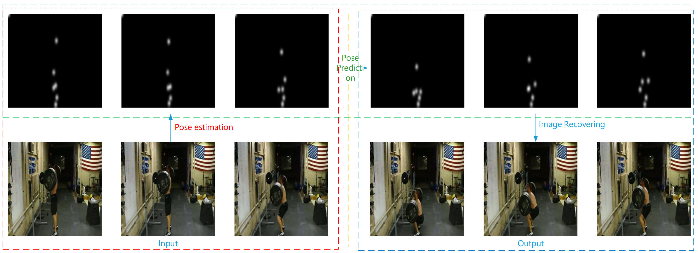

## Dataset
We train and evaluate our models on the [Penn Action Dataset](http://dreamdragon.github.io/PennAction/). Below are examples of an image and a gaussianized pose.

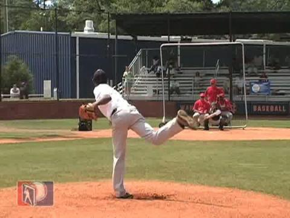 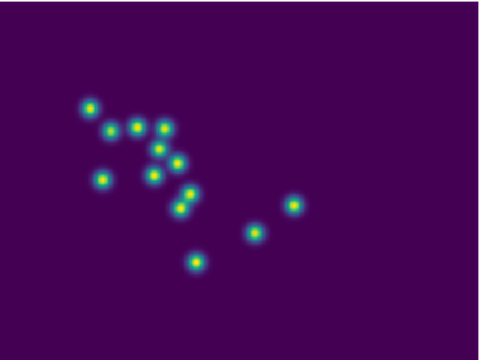

## Method
### LSTM

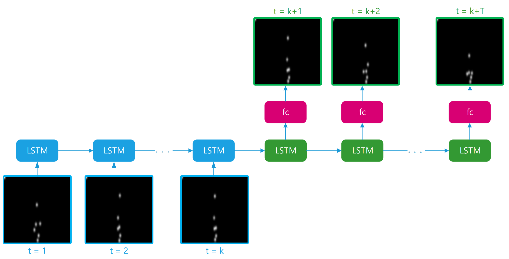

There are 13 (x, y) coordinates per pose. For the first k frames, we feed the 13 (x, y) coordinate values of the joints into the LSTM and iteratively generate the hidden states. For the next T frames, we feed in **0** and record the hidden state outputs from t = k + 1 to t = k + T. We use two fully connected layers on top of each hidden state vector to predict 13 (x, y) coordinates for the pose.


### Analogy Network

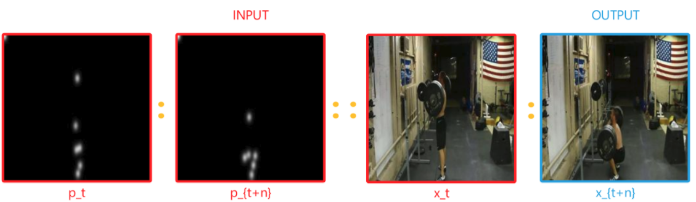
Our analogy network is a generative model that takes in the video frame at time t1, pose at time t1, and the pose at time t2 to predict the video frame at time t2. In our model, f_img and f_pose are both encoders implemented as the first c convolution layers of VGG (c is a parameter that we explore), and f_dec is the decoder implemented with deconvolutions mirroring the VGG convolutions of the encoders. Here our pose are gaussian heatmaps with the joint (x, y) coordinates as centers (g represents the gaussian operator).

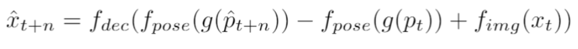
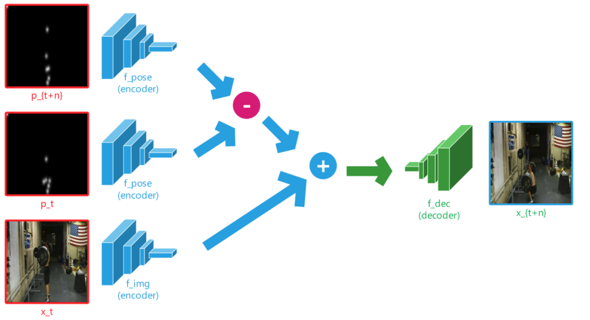

Our loss function has three parts.

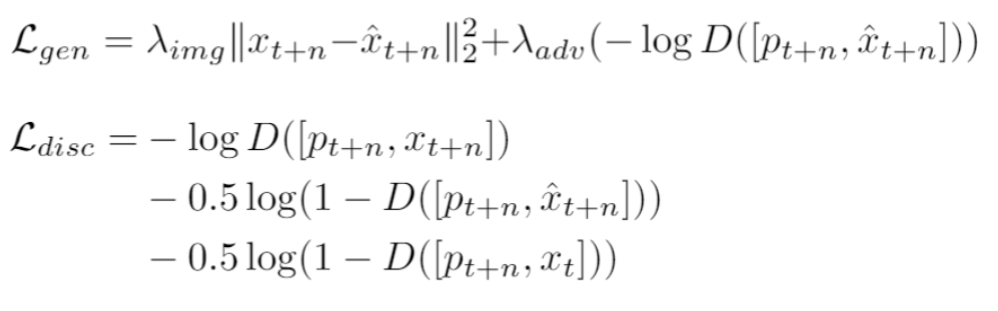

## Results
Results for actions on Penn Action Dataset.

|   Baseball Pitch   |  Baseball Swing  | Bench Press | Bowl |
| ------------- |:-------------:|:-----:|:-----:|
| 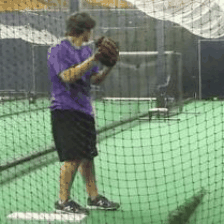    | 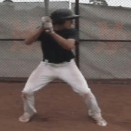   |   | 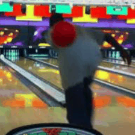   |

|   Clean and Jerk  |  Golf Swing  | Jump Rope | Jumping Jacks |
| ------------- |:-------------:|:-----:|:-----:|
|     | 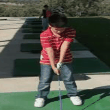   |  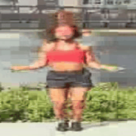 | 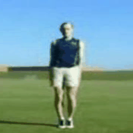   |

|   Pullup  |  Pushup  | Squat | Tennis Serve |
| ------------- |:-------------:|:-----:|:-----:|
| 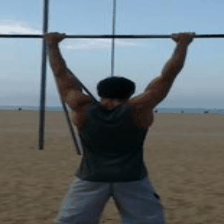    | 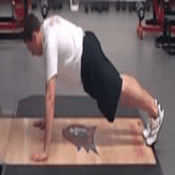   |  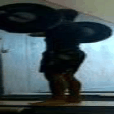 | 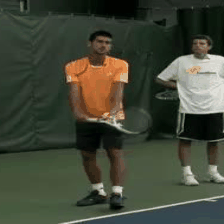   |

## Experimentation
### Truncated VGG convolution layers

### Full Image vs Crop

### Conv5 vs Conv5 + Residual 

### Checkboarding and Deconvolution Artifacts

## How to Run
```markdown
python run2.py --model villegas_combined --config rgb_L_13_cropped_consistent 
```

