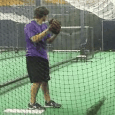

# Hierarchical Video Prediction

Zhongxia Yan, Jeffrey Zhang

We implemented a generative model to predict future frames of a human action video hierarchically. This repo contains all of the infrastructure and logic for our project. Our models extends off the model described in [Learning to Generate Long-term Future via Hierarchical Prediction](https://sites.google.com/a/umich.edu/rubenevillegas/hierch_vid). We independently explored many ways to improve the model and document the explorations here.

## Summary
Video prediction involves predicting T future frames of a video given k original frames of the video. Our hierarchical approach predicts **human action** videos by taking the pose (location of human joints) in the k original frames (we can estimate the pose using methods such as the [Hourglass Network](https://arxiv.org/abs/1603.06937)), predicting the pose in the next T frames, then predicting T frames that correspond to the T poses and also match the k original frames.


## Dataset
We train and evaluate our models on the [Penn Action Dataset](http://dreamdragon.github.io/PennAction/). Below are examples of an image and a gaussianized pose.

 

## Method
### LSTM


There are 13 (x, y) coordinates per pose. For the first k frames, we feed the 13 (x, y) coordinate values of the joints into the LSTM and iteratively generate the hidden states. For the next T frames, we feed in **0** and record the hidden state outputs from t = k + 1 to t = k + T. We use two fully connected layers on top of each hidden state vector to predict 13 (x, y) coordinates for the pose.


### Analogy Network


Our analogy network is a generative model that takes in the video frame at time t1, pose at time t1, and the pose at time t2 to predict the video frame at time t2. In our model, f_img and f_pose are both encoders implemented as the first c convolution layers of VGG (c is a parameter that we explore), and f_dec is the decoder implemented with deconvolutions mirroring the VGG convolutions of the encoders. Here our pose are gaussian heatmaps with the joint (x, y) coordinates as centers (g represents the gaussian operator).


Our loss function has three parts.


## Results
We present the results of our analogy network. For each action, the top gif is the ground truth, while the bottom gif is the output of our analogy network. Note: if the top and bottom gifs are out of sync, refresh the page.

|   Baseball Pitch   |  Baseball Swing  | Bench Press | Bowl |
| ------------- |:-------------:|:-----:|:-----:|
|     |    |   |    |

|   Clean and Jerk  |  Golf Swing  | Jump Rope | Jumping Jacks |
| ------------- |:-------------:|:-----:|:-----:|
|     |    |   |    |

|   Pullup  |  Pushup  | Squat | Tennis Serve |
| ------------- |:-------------:|:-----:|:-----:|
|     |    |   |    |

### Discussion
We can see that the outputs of the analogy network captures the semantics of the human figure well. The generation is able to generate a human figure that fits the locations of the joints at time t + n, with an almost perfectly unaltered background. Both the figure and background are not blurry. However, we found that the discriminator is not able to train the generator to perfectly reconstruct facial and other fine details. In addition, the discriminator not able to constrain the the generated figure in time t + n to look the same as the true human figures in time t, i.e. often human figures in time t + n wears different colored clothes. Additionally, instruments and tools used by humans (e.g., barbells, bats, rackets, etc.) had difficulty transferring over into the generated frames. Finally, although the generator is able to erase most of the figure from its location at time t, there is sometimes a shadow of leftover human figure, and interpolation of background at the location of the human at time t sees limited success. In summary, the analogy network captures the semantics of the human figure well, but sometimes fails at generating fine details and non-human areas / objects realistically.

## Experimentation

The results above are our best and we've experiment with various network architectures and parameters along the way.

### Weak Discriminator
Initially we trained our discriminator with `GradientDescentOptimizer` and realized that this optimizer was not strong enough (loss was not converging), so we switched to using `AdamOptimizer`. We show the comparison below, along with a L2 only (no discriminator and adversarial loss) baseline implementation. We can see that the weaker discriminator still outputs sharper images than L2 alone.

<p>
	   
	<em>Left to right: Ground truth, "strong" discriminator, "weak" discriminator, no discriminator</em>
</p>

### Truncated VGG convolution layers

### Full Image vs Crop


## How to Run
```markdown
python run2.py --model villegas_combined --config rgb_L_13_cropped_consistent 
```

